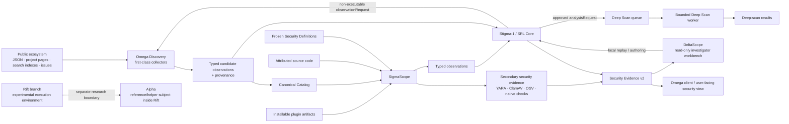

## Generic SigmaScope requests now use the canonical scan queue

SigmaScope is now a generic Analysis Broker/Dispatcher target without gaining a second scanner queue. `omega.analysis-request.v1` requests for active SigmaScope observation providers are validated by `tools/security/sigmascope_request_adapter.py`, bound to one exact canonical variant/artifact, merged into the existing artifact/source scan-queue item, selected exactly for the brokered invocation, and verified against candidate Evidence-v2 before the dispatcher claim may settle. Planned providers such as `binarySignatureTrust` remain non-dispatchable until their collector implementation becomes active.

The default-branch worker-pool template now explicitly allow-lists **Omega Discovery + SigmaScope**. Rollout is fail-safe: the reusable batch-claim workflow still defaults to Discovery only, so an older `main` runner cannot lease SigmaScope work it does not know how to launch. SigmaScope remains `maxConcurrent: 1` until scan execution is separated from serialized Evidence-v2 merge/publication.

The implementation roadmap, including missing components and remaining collector/control-plane work, is tracked in [`docs/platform/MISSING-COMPONENTS.md`](docs/platform/MISSING-COMPONENTS.md).

## Analysis Dispatcher: leased queue runner for component work

Omega now has the missing execution bridge between the non-executing Analysis Broker and component launchers. The broker still decides which typed observation is needed and which registered provider/component is eligible. The new dispatcher does only queue mechanics: recover expired leases, claim one highest-priority dispatchable work item, re-resolve the current registries, route through an explicit allow-listed job on the default `main` branch, and settle/retry the exact claim. Queue JSON can never provide an executable workflow path.

The thin `main` caller template polls every five minutes and can now allow-list **Omega Discovery and SigmaScope**. SigmaScope broker work is adapted into the same canonical scan queue used by ordinary scanning, so generic dispatch adds orchestration lineage without creating a duplicate scanner state model. This pass does not modify Rift implementation.

## Broker-bound Rift runtime evidence is now a production Evidence-v2 input

Interdimensional Rift now has a fail-closed production bridge into `security-evidence-v2`. A runtime run remains **neutral observation evidence**: Rift does not assign severity or findings. A trusted analysis-broker request binds the current Evidence-v2 `variantId` and distributed artifact SHA-256; the Rift-side broker wrapper verifies the exact package before execution; supervisor attestation v2 binds the request/variant/package identity to the exact runtime-report SHA-256; the SigmaScope-side adapter independently validates that chain before creating a candidate Evidence-v2 snapshot. Stigma-1 consumes the retained typed Rift observation bundle.

Existing standalone Rift workflows remain compatible with supervisor attestation v1, but v1/unbound reports are intentionally **not publishable** through the production adapter. The existing Stigma-1 deep-scan worker remains static/non-executing; broker routing of selected dynamic requests into Rift is the next control-plane pass. Alpha remains a component inside Rift.

## First-class collectors, Omega Discovery, and fresh client publication

**Omega Discovery** (`omega.discovery`) is now a first-class ecosystem-intelligence component. Its six-hour worker combines public PluginMaster discovery, GitHub code search, canonical project/README links, bounded repository-tree inspection, source issues and an optional configured web-search API. Collector implementations have stable `omega.collector.*` identities and publish typed, provenance-bearing observations through `omega.collector-registry.v1`.

Stigma-1 rules bind the logical observation type rather than a collector implementation. A matching rule may emit a non-executable `observationRequest`; Stigma-1 resolves registered provider candidates while orchestration alone retains execution authority. This same contract reserves a future Rift runtime provider without making Rift part of the production scan path today.

The catalog pipeline publishes Omega from a **fresh allow-listed SQLite projection** rather than distributing a compacted copy of the rich normalization/security database. Detailed historical/audit facts stay in `catalog-data` and `security-evidence-v2`. The replaceable `catalog-discovery` branch remains non-authoritative; novel feeds are normalized once into bounded reusable discovery shards, and the canonical daily builder consumes those fresh shards without immediately refetching them while remaining the sole catalog/Definitions identity authority.

To activate the scheduled discovery path, the thin `catalog-discovery-launcher.yml` must be present on the default branch; its reusable worker lives on `sigmascope`.

<p align="center">
  
</p>

# Omega

**Dalamud plugin marketplace · SigmaScope · Stigma-1 · DeltaScope · Rift**

Omega is a plugin marketplace for Dalamud backed by a broader discovery, catalog and security-evidence platform. The same repository contains the user-facing **Omega C# client** and the infrastructure used to discover public plugins, inspect installable artifacts, retain attributable source and runtime observations, evaluate deterministic security rules, and publish evidence that can be reviewed by users and researchers.

The project is organized across long-lived branches because the client, security services, runtime sandbox and generated data have different lifecycles. That branch split is an **ownership and deployment boundary inside one Omega repository**, not a separation into unrelated projects. `main` carries the Omega client and its regression tests; `sigmascope` carries SigmaScope, Stigma-1, DeltaScope and security-service tooling; `rift` carries the Interdimensional Rift and Alpha; generated catalog and security evidence live on their publication branches.

> [!IMPORTANT]
> Omega is not just the scanner, and SigmaScope is not a separate product from Omega. The C# marketplace client, the security services, the rule system, the research workbench and the runtime-observation environment are different parts of the same repository and security model.

---

## What this repository is trying to solve

Dalamud plugins run inside the Final Fantasy XIV process and can have meaningful access to the user's computer, game state, files, network, native libraries, processes and external services. A plugin marketplace therefore needs more than a simple *known / unknown* label.

Omega's security model is built around **evidence and explainability**:

- inspect the **exact installable artifact**, not just a project page;
- analyze attributed source code when it is available, without pretending source automatically proves the artifact;
- record **what was observed**, separately from the conclusions drawn from it;
- keep scanner findings, rule revisions, external intelligence and provenance reproducible;
- distinguish **severity** from **review coverage**;
- allow new intelligence or new rules to be projected over retained observations without automatically rescanning unchanged plugins when the retained evidence is sufficient;
- escalate interesting cases into deeper, bounded analysis without letting rules execute arbitrary code;
- expose the resulting evidence to researchers through DeltaScope and, ultimately, to users through Omega.

The goal is not to declare that third-party software is magically "safe." The goal is to make its observable behavior, provenance and risk signals **visible, inspectable and harder to hide**.

---

## The security architecture



The important architectural boundary is:

```text
SigmaScope  ->  Stigma-1  <-  DeltaScope
```

SigmaScope and DeltaScope do **not** call each other as peer services. They share the same deterministic rule language and data contracts while keeping production authority separate from research tooling.

---

## Components

| Component | Role |
| --- | --- |
| **Omega** | The wider plugin-discovery and marketplace ecosystem. It consumes security information but is not the scanner itself. |
| **Omega Discovery** | First-class ecosystem-intelligence component (`omega.discovery`). Bounded collectors publish typed candidate observations and provenance; it cannot assign catalog identity or make security verdicts. |
| **SigmaScope** | The production security scanner and Evidence-v2 pipeline. It inspects plugin artifacts, source and retained observations under bounded policies. |
| **Stigma-1** | The shared deterministic rule system. Its technical core is **SRL — SigmaScope Rule Language**. |
| **DeltaScope** | A developer/research workbench for browsing evidence, investigating incidents, keeping local Investigator notebooks/cases, replaying rules and authoring candidate rules. Plugin Developer My Plugins is logical-plugin-level and current-compatible by default, with old/unsupported identities available through a local display preference and a read-only cross-source sibling comparison in the selected dossier. Local case/rule/preferences state never becomes production security authority. |
| **Security Definitions** | Frozen, reviewable scanner data: capability vocabulary, Definition Packs, YARA policy/rules and other security inputs. |
| **Security Evidence v2** | The publication format that preserves scanner output, observations, provenance, revisions and read-only workbench indexes. |
| **Deep Scan** | A separate evidence-acquisition workflow for cases that justify more analysis than the normal scan budget. |
| **Rift** | A separate experimental/developer execution environment on the `rift` branch. It is not part of the normal SigmaScope production scan path. |
| **Alpha** | A reference/helper subject **inside Rift**, used by that research environment. |

---

## SigmaScope

SigmaScope is the artifact-first security scanner.

For each plugin variant it can retain and publish evidence such as:

- exact artifact identity and SHA-256;
- ZIP/package safety information;
- managed and native binary classification;
- .NET metadata, references, P/Invoke maps and selected call relationships;
- filesystem, process, registry, network, listener, clipboard, credential and execution-related static behavior signals;
- endpoint and URL observations;
- native imports and binary characteristics;
- dependencies/components and advisory relationships;
- source availability, source provenance and source-review coverage;
- developer-supplied `.omega/plugin.yaml` declarations as **untrusted explanatory context**;
- YARA results from reviewed first-party rules;
- ClamAV and OSV-derived evidence where available;
- rule-neutral observation collections suitable for later deterministic reprojection.

A developer declaration can explain expected behavior, but it cannot suppress scanner findings, lower severity, override secondary scanners or prove that source code matches the shipped binary.

### Artifact first, source second

A recurring principle in this repository is that these are different questions:

```text
What is inside the plugin users can install?
What does the attributed public source show?
Can we prove that source produced this artifact?
```

Omega keeps those answers separate instead of collapsing them into a single trust flag.

---

## Stigma-1 — SRL Core

**Stigma-1** is the shared rule layer used by SigmaScope and DeltaScope. Its implementation is intentionally constrained and non-executable.

Rules operate on registered, typed observations and facts. They do not receive arbitrary access to the filesystem, shell, environment, network, SQL, templates or executable code.

The current source library in this snapshot contains:

- **6 Definition Packs**;
- **55 rules**;
- **15 fixtures**;
- **16 reviewed production-tier migration rules**;
- **39 experimental research/authoring rules**.

Experimental rules are visible and testable in DeltaScope, but simply existing in the repository does **not** make them production-active.

Production SRL finding write-back remains separately gated. The repository deliberately distinguishes *"we can compile and replay this rule"* from *"this rule is authorized to change production findings."*

Read more:

- [`docs/STIGMA-1.md`](docs/STIGMA-1.md)
- [`docs/SIGMASCOPE-RULE-LANGUAGE.md`](docs/SIGMASCOPE-RULE-LANGUAGE.md)
- [`docs/DEFINITION-PACKS.md`](docs/DEFINITION-PACKS.md)
- [`docs/DELTASCOPE-RULE-WORKBENCH.md`](docs/DELTASCOPE-RULE-WORKBENCH.md)

---

## Adaptive Deep Scan

A normal security scan has intentionally bounded runtime and data limits. Some findings deserve a closer look without turning every catalog run into an unlimited analysis job.

Stigma-1 therefore supports a typed `analysisRequest` outcome. An approved frozen rule can request one of Omega's code-owned analysis profiles and a bounded depth:

- `standard`
- `extended`
- `exhaustive`

The rule may describe **why** more evidence is useful, but it cannot provide arbitrary commands, runner paths, network policy, timeouts or executable payloads.

The currently executable profile is `artifact-differential-v1`, which compares an exact candidate artifact with an approved stable-publisher baseline using the same **non-executing** static inspection model.

> [!NOTE]
> `sandbox-differential-v1` is reserved but intentionally unavailable until a genuinely isolated plugin-execution environment exists. Untrusted plugins are not executed on an ordinary GitHub Actions runner.

Deep Scan results currently remain durable analysis results; feeding those results back into a second authoritative production Stigma-1 evaluation is a later architecture step.

See [`docs/DEEP-SCAN-WORKFLOW.md`](docs/DEEP-SCAN-WORKFLOW.md).

---

## DeltaScope

DeltaScope is the human-facing security workbench for plugin developers, investigators, security researchers and operators. Its OpenShift-style perspective switch changes the workbench navigation and primary workflows while every perspective continues to consume the same read-only Security Evidence v2 state.

For a selected plugin, DeltaScope 4.21.5 also builds a deterministic **Next actions** plan from the evidence already in the dossier. It routes the developer to the relevant existing view (findings, sibling comparison, supply chain, malware, history or immutable evidence) without creating new security authority or production work.

The four perspectives are:

- **Plugin Developer** — understand what Omega found on your plugin, review changes, improve source/build context, and build a validated `.omega/plugin.yaml` explanation from current observations;
- **Investigator** — follow one plugin or case through its evidence-backed Journey, findings, rules and relationships;
- **Security Researcher** — study ecosystem-wide patterns, audit detection coverage/blind spots, inspect relationships, Stigma-1 rules, comparisons and raw retained evidence;
- **Operations** — inspect pipeline health, collector trends, the explained coverage-first Scan Queue, GitHub Actions and intentional production authority gates without turning DeltaScope into a control plane.

Journey nodes explain the exact selected plugin stage inline before offering raw technical details. The Plugin Developer profile builder uses the same bounded profile validator as SigmaScope and only produces browser-copy/download output; developer declarations never suppress findings or alter severity.

See [`docs/DELTASCOPE-PERSPECTIVES.md`](docs/DELTASCOPE-PERSPECTIVES.md).

It can:

- inspect published findings alongside separate local-only Investigator notebooks/cases, with bounded reference-health resolution and a local investigation timeline;
- browse plugins, variants, artifacts, source, binaries, dependencies and endpoints;
- pivot through endpoint/component/advisory relationships;
- inspect the exact frozen rule provenance behind published evidence;
- view Evidence-v2 revision and coverage health;
- explain why SigmaScope queue work is due, whether a real identity baseline reset is active, and why coverage-first ordering may visibly return to A;
- audit current-version detection/observation coverage and blind spots;
- replay Stigma-1 rules against retained observations;
- create and test local candidate rules and fixtures;
- preview Deep Scan requests produced by local rules;
- prepare a normal GitHub rule-candidate proposal for review.

It cannot:

- rewrite Security Evidence;
- change finding severity;
- activate or disable production rules;
- mutate scan queues;
- change catalog state;
- bypass GitHub review;
- turn a local rule into production policy.

That is deliberate. **DeltaScope is an investigator and authoring environment, not an administrative control plane.**

### Run DeltaScope locally

Prerequisite: **Python 3.10+** with `venv` and `pip` support.

Windows:

```bat
deltascope.cmd
```

Linux / macOS:

```bash
./deltascope.sh
```

Cross-platform:

```bash
python deltascope.py
```

The root launcher creates a private `.deltascope-venv`, installs the pinned dependencies from `tools/requirements-security.txt`, and launches the workbench.

Useful examples:

```bash
python deltascope.py --no-browser
python deltascope.py audit --evidence-v2 ./security-evidence-v2 --json
python deltascope.py rule-parity
```

---

## Security Evidence v2

Security Evidence v2 is the reproducible publication boundary between scanning and investigation.

The format is designed around:

- content-addressed identity;
- explicit schema/revision lineage;
- deterministic projection identities;
- independently verifiable hashes and byte counts;
- retained observations separate from derived conclusions;
- bounded transport sizes;
- read-only indexes for DeltaScope navigation;
- exact frozen Definitions provenance;
- compatibility checks that fail closed when evidence is insufficient for exact replay.

This separation matters. If a future Definitions update newly classifies a previously observed endpoint as malicious, SigmaScope can reason from the retained endpoint observation without pretending the plugin itself changed. If the necessary observation was not retained completely, the system asks for targeted re-analysis instead of inventing certainty from an old finding.

See [`docs/OBSERVATION-PROJECTION-CONTRACT.md`](docs/OBSERVATION-PROJECTION-CONTRACT.md).

---

## Security philosophy

### Evidence over reputation

A popular repository can still ship risky behavior. An obscure repository can still ship clean code. Source reputation is useful context, not a substitute for inspecting what is actually distributed.

### Observation over assumption

The scanner records what it can support with evidence. A URL literal is not described as a confirmed network connection; a source repository is not described as a verified build unless that relationship has actually been established.

### Coverage is not severity

`ARTIFACT ONLY`, `SOURCE CODE`, `never scanned`, `reviewed`, `high severity` and `low severity` describe different dimensions. They should not be compressed into a single green/red trust score.

### Deterministic automation

Production security decisions are made by code, frozen Definitions and deterministic rule evaluation. The Stigma-1 evaluator is not an LLM, and the repository does not rely on runtime AI to decide whether a plugin is malicious or safe.

### Fail closed at authority boundaries

Invalid Definitions, broken provenance, incomplete evidence, unsupported replay inputs or unauthorized candidate promotion should stop the authoritative path rather than silently weakening it.

### Research without silent promotion

DeltaScope can make experimentation easy while keeping promotion intentionally boring: validate, submit, review, merge, freeze, publish.

---

## Rule contribution flow

A candidate Stigma-1 rule follows a reviewable path:

```text
Local DeltaScope rule
        ↓
Candidate + positive/negative fixtures
        ↓
Local validation / replay
        ↓
GitHub rule-candidate Issue Form
        ↓
Permission gate + CI revalidation
        ↓
Normal pull request
        ↓
Human review / merge
        ↓
Daily Definitions freeze
        ↓
Authoritative frozen rule provenance
```

There is no auto-merge path and DeltaScope has no production write-back endpoint.

---

## Repository and branch layout

Omega is one repository with branch-owned subsystems:

| Branch | Role | Important locations |
| --- | --- | --- |
| **`main`** | Omega Dalamud client and client-facing release source | `Omega/`, `Omega.sln`, `Omega.RegressionTests/`, `repository/`, `sources/` |
| **`sigmascope`** | SigmaScope, Stigma-1 / SRL, DeltaScope, Deep Scan orchestration, Evidence-v2 tooling and security Definitions | `tools/security/`, `tools/catalog/`, `security-definitions/`, `docs/` |
| **`rift`** | Interdimensional Rift runtime-observation and containment environment; contains **Alpha** | `InterdimensionalRift/`, `InterdimensionalRift.DalamudShim/`, `tools/`, `docs/` |
| **`catalog-data`** | Generated catalog, Definitions and scan-queue state | generated publication data |
| **`security-evidence-v2`** | Published Security Evidence v2, history and projections | generated evidence data |
| **`website`** | Public Omega website | website source and assets |

The security-service side of the repository is primarily organized like this:

```text
.github/
  workflows/                 Reusable scanning, catalog, regression and rule workflows
  ISSUE_TEMPLATE/            Source and rule-candidate intake

docs/                        Architecture, contracts, Stigma-1 and workbench documentation
security-definitions/         Capabilities, Definition Packs, YARA and secondary-engine policy
sources/                      Curated/community repository discovery data

tools/security/               SigmaScope, Stigma-1, DeltaScope, Evidence-v2 and Deep Scan tooling
tools/catalog/                Catalog/source discovery and publication tooling

deltascope.py                 Cross-platform DeltaScope launcher
deltascope.cmd                Windows launcher
deltascope.sh                 Linux/macOS launcher
SECURITY-SERVICES.md          Detailed implementation/status notes
VALIDATION.md                 Validation and regression information
CHANGELOG.md                  Development history
```

---

## Security-service snapshot

The security-service sources represented by this snapshot include:

| Area | Snapshot state |
| --- | --- |
| SigmaScope | `2.15.0` |
| DeltaScope | `4.21.5` |
| Stigma-1 / SRL | Compiler/evaluator, replay, Definition Packs and authoring implemented |
| Definition Packs | 6 packs / 55 rules / 15 fixtures |
| Production SRL write-back | **Disabled / separately gated** |
| Deep Scan | Artifact differential profile implemented; adaptive depth implemented |
| Plugin execution in ordinary Actions | **No** |
| Rift / Alpha | Separate `rift` branch research environment |
| Focused packaged validation | 249 / 249 passing |
| Full packaged test inventory | 577 tests across 60 modules |


### DeltaScope My Plugins identity

In Plugin Developer, **My Plugins** is deliberately a logical catalog view rather than a security-variant list. The picker shows one active catalog plugin per canonical `plugin_id` and overlays current Evidence-v2 coverage for that plugin's active variants. Assembly name/version is display context, not merge authority. A plugin that exists in the catalog but has no current Evidence-v2 scan still appears as **UNSCANNED / NO CURRENT EVIDENCE**; that state must not be interpreted as safe or clean. Investigator and Security Researcher views retain variant-level inspection.

The selected logical-plugin dossier also shows **Cross-source comparison**. It highlights partial sibling coverage, version/API skew, and—in same-version + same-API cohorts only—artifact-hash or compact security-summary differences. These are review/navigation cues, not SigmaScope findings or repository trust verdicts. Different hashes across different plugin versions are normal version skew unless independent evidence says otherwise.

For detailed development and deployment notes, read [`HANDOVER.md`](HANDOVER.md), [`SECURITY-SERVICES.md`](SECURITY-SERVICES.md) and [`VALIDATION.md`](VALIDATION.md).

---

## Start here if you are…

### A plugin user

Omega's long-term purpose is to make security information understandable where you discover and install plugins. SigmaScope is the machinery that creates that evidence; DeltaScope is not something normal users need to operate.

### A plugin developer

Start with:

- [`docs/OMEGA-PLUGIN-PROFILE.md`](docs/OMEGA-PLUGIN-PROFILE.md)
- [`docs/BEHAVIOR-CONSISTENCY.md`](docs/BEHAVIOR-CONSISTENCY.md)
- [`docs/plugin-developers/`](docs/plugin-developers/)

The optional `.omega/plugin.yaml` profile lets you explain expected capabilities and services, but the scanner remains independent of that declaration.

### A security researcher or rule author

Start with:

- [`docs/STIGMA-1.md`](docs/STIGMA-1.md)
- [`docs/SIGMASCOPE-RULE-LANGUAGE.md`](docs/SIGMASCOPE-RULE-LANGUAGE.md)
- [`docs/rule-authors/`](docs/rule-authors/)
- DeltaScope's **Rules**, **Incidents**, **Intelligence** and **Documentation** workspaces.

### A contributor working on the architecture

Read:

- [`docs/ARCHITECTURE-SECURITY-MODEL.md`](docs/ARCHITECTURE-SECURITY-MODEL.md)
- [`docs/OBSERVATION-PROJECTION-CONTRACT.md`](docs/OBSERVATION-PROJECTION-CONTRACT.md)
- [`docs/DEEP-SCAN-WORKFLOW.md`](docs/DEEP-SCAN-WORKFLOW.md)
- [`BRANCH_HANDOVER.md`](BRANCH_HANDOVER.md)

---

## Why the names?

Omega's naming follows the Final Fantasy XIV-inspired language used throughout the wider project: separate systems have separate responsibilities, with the security stack deliberately framed as instruments that **observe, compare, classify and explain** rather than a single opaque verdict engine.

The names also help keep architectural boundaries explicit:

- **SigmaScope** observes and produces security evidence;
- **Stigma-1** evaluates deterministic security logic;
- **DeltaScope** lets humans investigate and experiment;
- **Rift** is where intentionally separate execution research belongs;
- **Alpha** is a component inside Rift, not a replacement for it.

---

## Closed-loop analysis acquisition (2026-08-25)

The SigmaScope control plane now closes the deterministic evidence-acquisition loop: retained Stigma-1 hard dependencies are projected into a hash-pinned observation-request sidecar, a freshness-aware `omega.observation-inventory.v1` checks whether the exact observation is already retained, and only unresolved work is idempotently reconciled into `analysis-broker-state`. The default-main dispatcher template then reconciles before reserving its parallel worker-pool slots.

```text
Stigma-1 hard dependency
        ↓
retained observation request / replay gap
        ↓
observation inventory ── fresh? ──► reuse retained evidence
        │ no
        ▼
Analysis Broker → durable queue → main Dispatcher → SigmaScope / Discovery
        ↑                                             │
        └──────────── next reconciliation ◄── retained evidence
```

The canonical remaining-work list is [`docs/platform/MISSING-COMPONENTS.md`](docs/platform/MISSING-COMPONENTS.md). The largest remaining platform items are parallel SigmaScope execution with serialized Evidence-v2 merge, Authenticode trust validation, ELF/Mach-O parity, prerequisite chaining/unresolved-provider reconciliation, the future Rebuilder and standalone Threat Intelligence components, Evidence-v2 compaction, and the full DeltaScope execution graph. Rift remains a separate external workstream.

## Project principle

> **Do not ask users to trust Omega. Give them enough evidence to understand what Omega saw.**

That is the direction of this repository: better coverage, better provenance, better explanations, safer rule evolution, and a plugin ecosystem where security findings can be inspected instead of merely asserted.

## Analysis Dispatcher worker-pool refinement

The generic dispatcher is now a short-lived parallel runner rather than a one-job synchronous chain. SRL/Stigma-1 observation requests become broker work; `analysis-dispatcher-batch-claim.yml` atomically persists leases before launch, with a default four-job global pool and component-specific `maxConcurrent` limits. The default-main runner then starts allow-listed worker workflows asynchronously, so a later dispatcher immediately sees existing `running` leases and can reserve different work. Omega Discovery is capped at one concurrent full refresh. In the current tree SigmaScope is also generic-broker dispatchable through the canonical scan-queue adapter, with `maxConcurrent: 1` until scan execution is separated from serialized Evidence-v2 merge/publication. No Rift implementation is changed by these SigmaScope passes.
