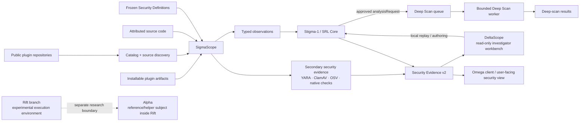

<p align="center">
  
</p>

# Omega

**Dalamud plugin marketplace · SigmaScope · Stigma-1 · DeltaScope · Rift**

Omega is a plugin marketplace for Dalamud backed by a broader discovery, catalog and security-evidence platform. The same repository contains the user-facing **Omega C# client** and the infrastructure used to discover public plugins, inspect installable artifacts, retain attributable source and runtime observations, evaluate deterministic security rules, and publish evidence that can be reviewed by users and researchers.

The project is organized across long-lived branches because the client, security services, runtime sandbox and generated data have different lifecycles. That branch split is an **ownership and deployment boundary inside one Omega repository**, not a separation into unrelated projects. `main` carries the Omega client and its regression tests; `sigmascope` carries SigmaScope, Stigma-1, DeltaScope and security-service tooling; `rift` carries the Interdimensional Rift and Alpha; generated catalog and security evidence live on their publication branches.

> [!IMPORTANT]
> Omega is not just the scanner, and SigmaScope is not a separate product from Omega. The C# marketplace client, the security services, the rule system, the research workbench and the runtime-observation environment are different parts of the same repository and security model.

---

## What this repository is trying to solve

Dalamud plugins run inside the Final Fantasy XIV process and can have meaningful access to the user's computer, game state, files, network, native libraries, processes and external services. A plugin marketplace therefore needs more than a simple *known / unknown* label.

Omega's security model is built around **evidence and explainability**:

- inspect the **exact installable artifact**, not just a project page;
- analyze attributed source code when it is available, without pretending source automatically proves the artifact;
- record **what was observed**, separately from the conclusions drawn from it;
- keep scanner findings, rule revisions, external intelligence and provenance reproducible;
- distinguish **severity** from **review coverage**;
- allow new intelligence or new rules to be projected over retained observations without automatically rescanning unchanged plugins when the retained evidence is sufficient;
- escalate interesting cases into deeper, bounded analysis without letting rules execute arbitrary code;
- expose the resulting evidence to researchers through DeltaScope and, ultimately, to users through Omega.

The goal is not to declare that third-party software is magically "safe." The goal is to make its observable behavior, provenance and risk signals **visible, inspectable and harder to hide**.

---

## The security architecture



The important architectural boundary is:

```text
SigmaScope  ->  Stigma-1  <-  DeltaScope
```

SigmaScope and DeltaScope do **not** call each other as peer services. They share the same deterministic rule language and data contracts while keeping production authority separate from research tooling.

---

## Components

| Component | Role |
| --- | --- |
| **Omega** | The wider plugin-discovery and marketplace ecosystem. It consumes security information but is not the scanner itself. |
| **SigmaScope** | The production security scanner and Evidence-v2 pipeline. It inspects plugin artifacts, source and retained observations under bounded policies. |
| **Stigma-1** | The shared deterministic rule system. Its technical core is **SRL — SigmaScope Rule Language**. |
| **DeltaScope** | A developer/research workbench for browsing evidence, investigating incidents, replaying rules and authoring candidate rules. It is intentionally not a production control plane. |
| **Security Definitions** | Frozen, reviewable scanner data: capability vocabulary, Definition Packs, YARA policy/rules and other security inputs. |
| **Security Evidence v2** | The publication format that preserves scanner output, observations, provenance, revisions and read-only workbench indexes. |
| **Deep Scan** | A separate evidence-acquisition workflow for cases that justify more analysis than the normal scan budget. |
| **Rift** | A separate experimental/developer execution environment on the `rift` branch. It is not part of the normal SigmaScope production scan path. |
| **Alpha** | A reference/helper subject **inside Rift**, used by that research environment. |

---

## SigmaScope

SigmaScope is the artifact-first security scanner.

For each plugin variant it can retain and publish evidence such as:

- exact artifact identity and SHA-256;
- ZIP/package safety information;
- managed and native binary classification;
- .NET metadata, references, P/Invoke maps and selected call relationships;
- filesystem, process, registry, network, listener, clipboard, credential and execution-related static behavior signals;
- endpoint and URL observations;
- native imports and binary characteristics;
- dependencies/components and advisory relationships;
- source availability, source provenance and source-review coverage;
- developer-supplied `.omega/plugin.yaml` declarations as **untrusted explanatory context**;
- YARA results from reviewed first-party rules;
- ClamAV and OSV-derived evidence where available;
- rule-neutral observation collections suitable for later deterministic reprojection.

A developer declaration can explain expected behavior, but it cannot suppress scanner findings, lower severity, override secondary scanners or prove that source code matches the shipped binary.

### Artifact first, source second

A recurring principle in this repository is that these are different questions:

```text
What is inside the plugin users can install?
What does the attributed public source show?
Can we prove that source produced this artifact?
```

Omega keeps those answers separate instead of collapsing them into a single trust flag.

---

## Stigma-1 — SRL Core

**Stigma-1** is the shared rule layer used by SigmaScope and DeltaScope. Its implementation is intentionally constrained and non-executable.

Rules operate on registered, typed observations and facts. They do not receive arbitrary access to the filesystem, shell, environment, network, SQL, templates or executable code.

The current source library in this snapshot contains:

- **6 Definition Packs**;
- **55 rules**;
- **15 fixtures**;
- **16 reviewed production-tier migration rules**;
- **39 experimental research/authoring rules**.

Experimental rules are visible and testable in DeltaScope, but simply existing in the repository does **not** make them production-active.

Production SRL finding write-back remains separately gated. The repository deliberately distinguishes *"we can compile and replay this rule"* from *"this rule is authorized to change production findings."*

Read more:

- [`docs/STIGMA-1.md`](docs/STIGMA-1.md)
- [`docs/SIGMASCOPE-RULE-LANGUAGE.md`](docs/SIGMASCOPE-RULE-LANGUAGE.md)
- [`docs/DEFINITION-PACKS.md`](docs/DEFINITION-PACKS.md)
- [`docs/DELTASCOPE-RULE-WORKBENCH.md`](docs/DELTASCOPE-RULE-WORKBENCH.md)

---

## Adaptive Deep Scan

A normal security scan has intentionally bounded runtime and data limits. Some findings deserve a closer look without turning every catalog run into an unlimited analysis job.

Stigma-1 therefore supports a typed `analysisRequest` outcome. An approved frozen rule can request one of Omega's code-owned analysis profiles and a bounded depth:

- `standard`
- `extended`
- `exhaustive`

The rule may describe **why** more evidence is useful, but it cannot provide arbitrary commands, runner paths, network policy, timeouts or executable payloads.

The currently executable profile is `artifact-differential-v1`, which compares an exact candidate artifact with an approved stable-publisher baseline using the same **non-executing** static inspection model.

> [!NOTE]
> `sandbox-differential-v1` is reserved but intentionally unavailable until a genuinely isolated plugin-execution environment exists. Untrusted plugins are not executed on an ordinary GitHub Actions runner.

Deep Scan results currently remain durable analysis results; feeding those results back into a second authoritative production Stigma-1 evaluation is a later architecture step.

See [`docs/DEEP-SCAN-WORKFLOW.md`](docs/DEEP-SCAN-WORKFLOW.md).

---

## DeltaScope

DeltaScope is the human-facing security workbench for developers and researchers.

It can:

- inspect the newest findings and investigation cases;
- browse plugins, variants, artifacts, source, binaries, dependencies and endpoints;
- pivot through endpoint/component/advisory relationships;
- inspect the exact frozen rule provenance behind published evidence;
- view Evidence-v2 revision and coverage health;
- replay Stigma-1 rules against retained observations;
- create and test local candidate rules and fixtures;
- preview Deep Scan requests produced by local rules;
- prepare a normal GitHub rule-candidate proposal for review.

It cannot:

- rewrite Security Evidence;
- change finding severity;
- activate or disable production rules;
- mutate scan queues;
- change catalog state;
- bypass GitHub review;
- turn a local rule into production policy.

That is deliberate. **DeltaScope is an investigator and authoring environment, not an administrative control plane.**

### Run DeltaScope locally

Prerequisite: **Python 3.10+** with `venv` and `pip` support.

Windows:

```bat
deltascope.cmd
```

Linux / macOS:

```bash
./deltascope.sh
```

Cross-platform:

```bash
python deltascope.py
```

The root launcher creates a private `.deltascope-venv`, installs the pinned dependencies from `tools/requirements-security.txt`, and launches the workbench.

Useful examples:

```bash
python deltascope.py --no-browser
python deltascope.py audit --evidence-v2 ./security-evidence-v2 --json
python deltascope.py rule-parity
```

---

## Security Evidence v2

Security Evidence v2 is the reproducible publication boundary between scanning and investigation.

The format is designed around:

- content-addressed identity;
- explicit schema/revision lineage;
- deterministic projection identities;
- independently verifiable hashes and byte counts;
- retained observations separate from derived conclusions;
- bounded transport sizes;
- read-only indexes for DeltaScope navigation;
- exact frozen Definitions provenance;
- compatibility checks that fail closed when evidence is insufficient for exact replay.

This separation matters. If a future Definitions update newly classifies a previously observed endpoint as malicious, SigmaScope can reason from the retained endpoint observation without pretending the plugin itself changed. If the necessary observation was not retained completely, the system asks for targeted re-analysis instead of inventing certainty from an old finding.

See [`docs/OBSERVATION-PROJECTION-CONTRACT.md`](docs/OBSERVATION-PROJECTION-CONTRACT.md).

---

## Security philosophy

### Evidence over reputation

A popular repository can still ship risky behavior. An obscure repository can still ship clean code. Source reputation is useful context, not a substitute for inspecting what is actually distributed.

### Observation over assumption

The scanner records what it can support with evidence. A URL literal is not described as a confirmed network connection; a source repository is not described as a verified build unless that relationship has actually been established.

### Coverage is not severity

`ARTIFACT ONLY`, `SOURCE CODE`, `never scanned`, `reviewed`, `high severity` and `low severity` describe different dimensions. They should not be compressed into a single green/red trust score.

### Deterministic automation

Production security decisions are made by code, frozen Definitions and deterministic rule evaluation. The Stigma-1 evaluator is not an LLM, and the repository does not rely on runtime AI to decide whether a plugin is malicious or safe.

### Fail closed at authority boundaries

Invalid Definitions, broken provenance, incomplete evidence, unsupported replay inputs or unauthorized candidate promotion should stop the authoritative path rather than silently weakening it.

### Research without silent promotion

DeltaScope can make experimentation easy while keeping promotion intentionally boring: validate, submit, review, merge, freeze, publish.

---

## Rule contribution flow

A candidate Stigma-1 rule follows a reviewable path:

```text
Local DeltaScope rule
        ↓
Candidate + positive/negative fixtures
        ↓
Local validation / replay
        ↓
GitHub rule-candidate Issue Form
        ↓
Permission gate + CI revalidation
        ↓
Normal pull request
        ↓
Human review / merge
        ↓
Daily Definitions freeze
        ↓
Authoritative frozen rule provenance
```

There is no auto-merge path and DeltaScope has no production write-back endpoint.

---

## Repository and branch layout

Omega is one repository with branch-owned subsystems:

| Branch | Role | Important locations |
| --- | --- | --- |
| **`main`** | Omega Dalamud client and client-facing release source | `Omega/`, `Omega.sln`, `Omega.RegressionTests/`, `repository/`, `sources/` |
| **`sigmascope`** | SigmaScope, Stigma-1 / SRL, DeltaScope, Deep Scan orchestration, Evidence-v2 tooling and security Definitions | `tools/security/`, `tools/catalog/`, `security-definitions/`, `docs/` |
| **`rift`** | Interdimensional Rift runtime-observation and containment environment; contains **Alpha** | `InterdimensionalRift/`, `InterdimensionalRift.DalamudShim/`, `tools/`, `docs/` |
| **`catalog-data`** | Generated catalog, Definitions and scan-queue state | generated publication data |
| **`security-evidence-v2`** | Published Security Evidence v2, history and projections | generated evidence data |
| **`website`** | Public Omega website | website source and assets |

The security-service side of the repository is primarily organized like this:

```text
.github/
  workflows/                 Reusable scanning, catalog, regression and rule workflows
  ISSUE_TEMPLATE/            Source and rule-candidate intake

docs/                        Architecture, contracts, Stigma-1 and workbench documentation
security-definitions/         Capabilities, Definition Packs, YARA and secondary-engine policy
sources/                      Curated/community repository discovery data

tools/security/               SigmaScope, Stigma-1, DeltaScope, Evidence-v2 and Deep Scan tooling
tools/catalog/                Catalog/source discovery and publication tooling

deltascope.py                 Cross-platform DeltaScope launcher
deltascope.cmd                Windows launcher
deltascope.sh                 Linux/macOS launcher
SECURITY-SERVICES.md          Detailed implementation/status notes
VALIDATION.md                 Validation and regression information
CHANGELOG.md                  Development history
```

---

## Security-service snapshot

The security-service sources represented by this snapshot include:

| Area | Snapshot state |
| --- | --- |
| SigmaScope | `2.15.0` |
| DeltaScope | `4.6.3` |
| Stigma-1 / SRL | Compiler/evaluator, replay, Definition Packs and authoring implemented |
| Definition Packs | 6 packs / 55 rules / 15 fixtures |
| Production SRL write-back | **Disabled / separately gated** |
| Deep Scan | Artifact differential profile implemented; adaptive depth implemented |
| Plugin execution in ordinary Actions | **No** |
| Rift / Alpha | Separate `rift` branch research environment |
| Focused packaged validation | 64 / 64 passing |
| Full packaged test inventory | 494 tests across 49 modules |

For detailed development and deployment notes, read [`HANDOVER.md`](HANDOVER.md), [`SECURITY-SERVICES.md`](SECURITY-SERVICES.md) and [`VALIDATION.md`](VALIDATION.md).

---

## Start here if you are…

### A plugin user

Omega's long-term purpose is to make security information understandable where you discover and install plugins. SigmaScope is the machinery that creates that evidence; DeltaScope is not something normal users need to operate.

### A plugin developer

Start with:

- [`docs/OMEGA-PLUGIN-PROFILE.md`](docs/OMEGA-PLUGIN-PROFILE.md)
- [`docs/BEHAVIOR-CONSISTENCY.md`](docs/BEHAVIOR-CONSISTENCY.md)
- [`docs/plugin-developers/`](docs/plugin-developers/)

The optional `.omega/plugin.yaml` profile lets you explain expected capabilities and services, but the scanner remains independent of that declaration.

### A security researcher or rule author

Start with:

- [`docs/STIGMA-1.md`](docs/STIGMA-1.md)
- [`docs/SIGMASCOPE-RULE-LANGUAGE.md`](docs/SIGMASCOPE-RULE-LANGUAGE.md)
- [`docs/rule-authors/`](docs/rule-authors/)
- DeltaScope's **Rules**, **Incidents**, **Intelligence** and **Documentation** workspaces.

### A contributor working on the architecture

Read:

- [`docs/ARCHITECTURE-SECURITY-MODEL.md`](docs/ARCHITECTURE-SECURITY-MODEL.md)
- [`docs/OBSERVATION-PROJECTION-CONTRACT.md`](docs/OBSERVATION-PROJECTION-CONTRACT.md)
- [`docs/DEEP-SCAN-WORKFLOW.md`](docs/DEEP-SCAN-WORKFLOW.md)
- [`BRANCH_HANDOVER.md`](BRANCH_HANDOVER.md)

---

## Why the names?

Omega's naming follows the Final Fantasy XIV-inspired language used throughout the wider project: separate systems have separate responsibilities, with the security stack deliberately framed as instruments that **observe, compare, classify and explain** rather than a single opaque verdict engine.

The names also help keep architectural boundaries explicit:

- **SigmaScope** observes and produces security evidence;
- **Stigma-1** evaluates deterministic security logic;
- **DeltaScope** lets humans investigate and experiment;
- **Rift** is where intentionally separate execution research belongs;
- **Alpha** is a component inside Rift, not a replacement for it.

---

## Project principle

> **Do not ask users to trust Omega. Give them enough evidence to understand what Omega saw.**

That is the direction of this repository: better coverage, better provenance, better explanations, safer rule evolution, and a plugin ecosystem where security findings can be inspected instead of merely asserted.
